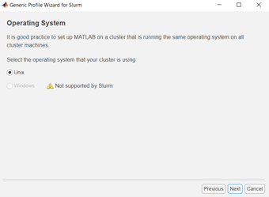

# Instructions to run Matlab on the NTU HPC Hamilton using Slurm

2021, William Navaraj

Note: Requires you to be either using a PC on campus connected to the NTU Wifi or use VPN (PulseSecure) to connect to the university network if you are off campus.

One time setup:
1)	Download the attached files to a folder say “C:\Users\%username%\Documents\MATLAB\StartUpFolder”. 
 
-parallel_slurm.mlpkginstall available [here](https://uk.mathworks.com/matlabcentral/fileexchange/52807-parallel-computing-toolbox-plugin-for-matlab-parallel-server-with-slurm)

-ParallelTest.m

-startup.m

2)	Home->Open->Change from “All MATLAB files” to “All Files *.* Choose parallel_slurm.mlpkginstall from the “StartUpFolder”.

 
3)	Run it and keep pressing next until it goes to the “Submission Mode”.  Can your cluster and client machines read and write to shared job storage location? Select No. 

 

 

4)	Additional Properties: Enter “clusterhost”: 152.71.6.200, “Remote Job Storage Location”: /users/<username>/MatlabWork/,
Use Unique Subfolders:Checked
Make sure username is entered in the place <username> 

5)	Workers: “Number of Workers”:2 (or whatever you want, consider keeping it small for initial test) , MatlabInstallationFolderForWorkers: /opt/apps/alces/matlab/R2020a/

6)	License: Leave it as network license manager
7)	ProfileDetails: “ProfileName:SlurmProfile1”, Description:Matlab Slurm Interface

8)	Create the profile
9)	(Set new cluster profile as default if required)
10)	(Do not validate now)

 

11)	Goto Matlab->Home->Preferences->General-> and < Specify path to a startup folder  where you downloaded startup.m Eg: “C:\Users\%username%\Documents\MATLAB\StartUpFolder” >

12)	Apply->OK to close.
13)	Close and restart Matlab

14)Goto	Home-> Parallel->Create and manage clusters

15)	Add “AdditionalSubmitArgs” and set a time parameter to it. 

 
AdditionalSubmitArgs --time=00:05:00 (Or whatever time the job is expected to run, keep it lower during the validation stage). Click on Done.
16)	Click on validate. It will take some time during the first execution as it goes into the queue of all other job submissions across NTU. When the HPC is free this may run faster. It will test all the major functions available in the Parallel Computing toolbox.

NOTE: Validation may fail if the HPC is too busy. Try when the HPC usage is relatively low.
 

Example Matlab Code:
17)	Open the ParallelTest.m example from the startup folder. Run it.

18)	Allow the app through the windows firewall, if required.

19)	Enter the username

20)	Use an identity file to login( You could choose no for now)

21)	Enter the password

22)	During the first execution when the parpool is created it will take time. Run it again. This time it will be much faster compared to a single thread execution.

23)	Once the parpool is set, on subsequent execution it will work faster. 
For more information:
https://uk.mathworks.com/help/parallel-computing/getting-started-with-parallel-computing-toolbox.html 

-https://github.com/williamnavaraj/Matlab_HPC_Slurm

